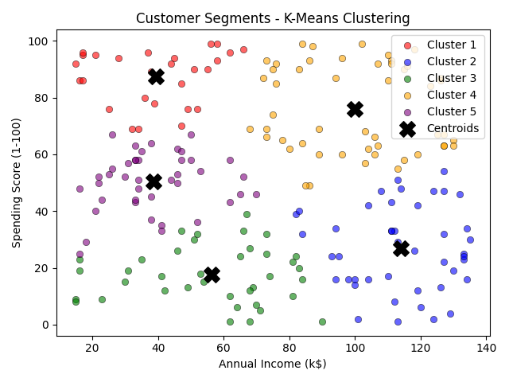
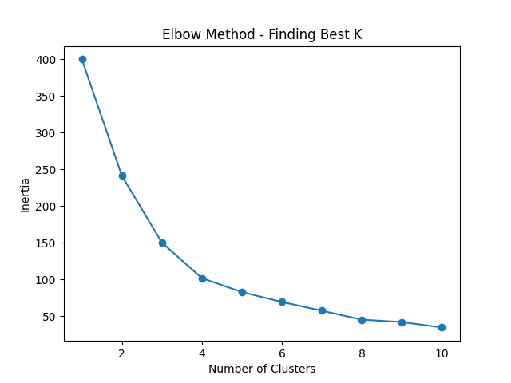

# Customer Segmentation using K-Means Clustering
SkillCraft Technology — Machine Learning Internship Task 2

## What it does
Groups mall customers into 5 distinct segments based on annual income and spending score.

## Result
- 5 customer segments identified using Elbow Method

## Tech Stack
Python, scikit-learn, matplotlib, numpy, pandas

## Output

